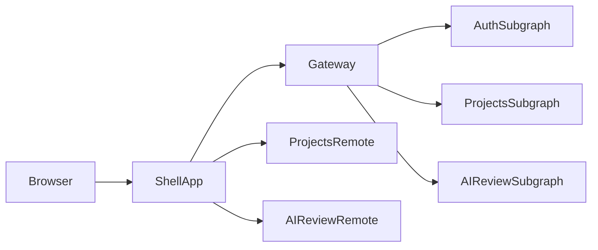

# DevPilot 2026 - Lab 3 Milestone

This repository contains the Lab 3 project milestone for COMP-308, implemented using micro-frontends, Apollo Gateway, GraphQL subgraphs, and session-based authentication.

## Team and Task Split

### Lab 3
Project Milestone: Micro Frontends, Gateway, GraphQL Subgraphs, and Session Authentication

| Member Name | User Story | What this story presents on the web page |
|---|---|---|
| Member 1 | As a logged-in developer, I want a single shell app that lets me move across Dashboard, Projects, AI Review, and Profile while loading remote apps seamlessly. | Sidebar navigation, route transitions, host + remote integration behavior, unified shell layout/theme. |
| Member 2 | As a user, I want to register, log in, stay logged in after refresh, and log out securely using session-based authentication. | Register/Login forms, protected routes, persistent authenticated state after refresh, Logout flow. |
| Member 3 | As a developer, I want to create projects, add feature requests, submit implementation drafts, and view/edit draft history for my work. | Project creation modal/form, feature add flow, project details page, draft list/history, and edit/delete/update actions. |
| Member 4 | As the platform, I want all frontend requests to go through one GraphQL gateway that coordinates Auth and Projects services and shows AI Review remote integration. | Working end-to-end data flow via single app UI, project/draft data retrieval and mutations through gateway, AI Review page loaded and connected in app flow. |

## Architecture Overview



## Implemented Milestone Scope

### Frontend (Micro-Frontends)

- Shell host app (`frontends/shell`)
- Projects remote app (`frontends/projects-app`)
- AI Review remote app (`frontends/ai-review-app`)
- Module Federation integration through Vite configs in each frontend app

### Backend

- Apollo Gateway with a single endpoint: `http://localhost:4000/graphql`
- Auth subgraph service: `services/auth-service` (`4001`)
- Projects subgraph service: `services/projects-service` (`4002`)
- AI Review subgraph service: `services/ai-review-service` (`4003`) for expanded project scope

### Authentication Foundation

- Session-based auth with HTTP-only cookies (`express-session`)
- MongoDB-backed session storage (`connect-mongo`)
- Auth operations: `register`, `login`, `logout`, `currentUser`
- Session persistence across browser refresh via `credentials: include`
- No JWT/localStorage token auth persistence

### Projects Foundation

- Create project
- View own projects
- Add feature request
- Submit implementation draft
- View draft history through project detail and dedicated `draftsByFeature` query
- Authorization checks by session user ownership

## Run Instructions

### 1) Prerequisites

- Node.js 18+ recommended
- Local MongoDB running on default port
- `.env` file in repo root

Example `.env`:

```env
MONGO_URI=mongodb://localhost:27017/devpilot
SESSION_SECRET=change-me-for-production
GEMINI_API_KEY=your-gemini-key-here
GROQ_API_KEY=your-groq-key-here
```

### 2) Install Dependencies

```bash
npm run install:all
```

### 3) Start Modes

- Full project mode (includes AI backend subgraph):

```bash
npm start
```

- Lab 3 milestone mode (AI backend optional, auth + projects only):

```bash
npm run start:milestone
```

In milestone mode, gateway starts with `ENABLE_AIREVIEW_SUBGRAPH=false`.

### 4) Access URLs

- Shell app: `http://localhost:3000`
- Projects app: `http://localhost:3001`
- AI Review app: `http://localhost:3002`
- Gateway: `http://localhost:4000/graphql`
- Auth subgraph: `http://localhost:4001/graphql`
- Projects subgraph: `http://localhost:4002/graphql`
- AI Review subgraph: `http://localhost:4003/graphql` (full mode only)

## Lab 3 Requirement Mapping

- Shell + 2 remotes integrated: implemented
- Apollo Gateway with subgraph communication: implemented
- Auth service with session cookies + Mongo sessions: implemented
- Projects service with core workflow: implemented
- AI Review app placeholder/remote integration: implemented
- Frontend connected through gateway: implemented
- README quality + organization: implemented (this file)

## Known Notes

- Full AI review quality depends on valid `GEMINI_API_KEY` and `GROQ_API_KEY`.
- Lab milestone mode exists to align with Week 10 scope where AI backend is not required.

